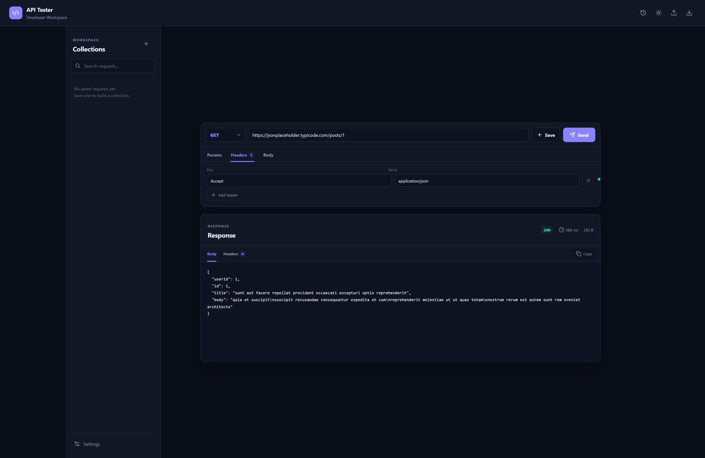

# 🚀 API Testing Tool

<p align="center">
  A modern, lightweight, Postman-inspired API testing tool built with <strong>React.js</strong> and <strong>Vite</strong>.
</p>

<p align="center">
  Test REST APIs, manage requests, inspect responses, save request collections, and maintain request history — all from a clean developer-focused interface.
</p>

<p align="center">
  
  
  
  
  
  
</p>

<p align="center">
  
  
</p>

---

## 📸 Screenshot

<p align="center">
  
</p>

---

## ✨ Features

### 🔌 API Requests

* Send HTTP requests directly from the browser
* Supports:

  * `GET`
  * `POST`
  * `PUT`
  * `PATCH`
  * `DELETE`
  * `HEAD`
  * `OPTIONS`
* Editable request URL
* Press `Enter` to quickly send a request

### 🔎 Query Parameters

Add dynamic query parameters to your API requests.

```text
?page=1&limit=10&search=react
```

Each parameter can be enabled or disabled individually.

### 🧾 Request Headers

Add custom HTTP headers such as:

```http
Accept: application/json
Content-Type: application/json
Authorization: Bearer YOUR_TOKEN
```

Headers can also be enabled or disabled without deleting them.

### 📦 Request Body

Supports:

* JSON
* Plain text

Example:

```json
{
  "title": "Hello API",
  "body": "Testing API from React",
  "userId": 1
}
```

### 📊 Response Viewer

The response section displays:

* HTTP status code
* Status message
* Response time
* Response size
* Response body
* Pretty-printed JSON

Example:

```json
{
  "id": 1,
  "title": "Hello API",
  "body": "Testing API from React",
  "userId": 1
}
```

### 📋 Copy Response

Copy the complete response body with one click.

### 🕘 Request History

Every request is automatically stored in the browser's `localStorage`.

History includes:

* HTTP method
* URL
* Status code
* Response time
* Response payload

You can reload previous requests from the history panel.

### 📁 Request Collections

Save frequently used requests into collections.

For example:

```text
Collections
├── Get User
├── Create User
├── Update User
└── Delete User
```

### 💾 LocalStorage Persistence

The application stores:

* Request history
* Saved requests
* Theme preference

This means your data remains available after refreshing the page.

### 🌙 Dark / Light Mode

Switch between:

* Dark mode
* Light mode

The selected theme is persisted in `localStorage`.

### 📤 Import / Export

Export your workspace as JSON:

```text
api-testing-tool-data.json
```

The exported data can contain:

```json
{
  "saved": [],
  "history": []
}
```

You can later import the JSON file back into the application.

### 📱 Responsive Design

The interface works across:

* Desktop
* Laptop
* Tablet
* Mobile

---

# 🛠️ Tech Stack

## Frontend

| Technology   | Purpose                       |
| ------------ | ----------------------------- |
| React.js     | UI development                |
| JavaScript   | Application logic             |
| Vite         | Development/build tooling     |
| CSS3         | Styling and responsive design |
| Lucide React | UI icons                      |
| Fetch API    | HTTP requests                 |
| LocalStorage | Client-side persistence       |

---

# 📂 Project Structure

```text
api-testing-tool/
│
├── public/
│
├── src/
│   ├── App.jsx
│   ├── main.jsx
│   └── styles.css
│
├── api-testing-tool.png
│
├── index.html
├── package.json
├── package-lock.json
└── README.md
```

---

# ⚙️ Installation

## 1. Clone the repository

```bash
git clone https://github.com/ajinkya029/api-testing-tool.git
```

## 2. Navigate into the project

```bash
cd api-testing-tool
```

## 3. Install dependencies

```bash
npm install
```

## 4. Start the development server

```bash
npm run dev
```

The application will be available at the local URL displayed by Vite, usually:

```text
http://localhost:5173
```

---

# 🏗️ Production Build

Create an optimized production build:

```bash
npm run build
```

Preview the production build:

```bash
npm run preview
```

---

# 🧪 Example API

You can test the application with public APIs such as:

```text
https://jsonplaceholder.typicode.com/posts/1
```

Example GET request:

```http
GET https://jsonplaceholder.typicode.com/posts/1
```

Example response:

```json
{
  "userId": 1,
  "id": 1,
  "title": "sunt aut facere repellat provident occaecati excepturi optio reprehenderit",
  "body": "quia et suscipit..."
}
```

---

# 📤 Example POST Request

Set the method to:

```text
POST
```

Use:

```text
https://jsonplaceholder.typicode.com/posts
```

Add the header:

```http
Content-Type: application/json
```

Request body:

```json
{
  "title": "API Testing Tool",
  "body": "Testing POST request",
  "userId": 1
}
```

Then click:

```text
Send
```

---

# ⚠️ CORS Limitation

Because this application runs directly inside the browser, some APIs may reject requests due to **CORS (Cross-Origin Resource Sharing)** restrictions.

You may see an error similar to:

```text
Failed to fetch
```

This does not necessarily mean that the API is unavailable.

The target API may simply not allow requests from your browser origin.

---

# 🔐 Production Architecture

For a production-grade API testing platform, a backend proxy can be introduced:

```text
┌──────────────────────┐
│      React App       │
│    API Tester UI     │
└──────────┬───────────┘
           │
           │ POST /api/proxy
           ▼
┌──────────────────────┐
│   Node.js / Express  │
│     API Proxy        │
└──────────┬───────────┘
           │
           │ HTTP Request
           ▼
┌──────────────────────┐
│      Target API      │
│   example.com/api    │
└──────────────────────┘
```

Example proxy request:

```json
{
  "url": "https://example.com/api/users",
  "method": "GET",
  "headers": {
    "Authorization": "Bearer TOKEN"
  }
}
```

> A production proxy should validate destination URLs and protect against SSRF. Do not expose an unrestricted open proxy.

---

# 🔮 Future Improvements

Potential enhancements include:

- Bearer Token authentication
- Basic Authentication
- API Key authentication
- OAuth 2.0 support
- Environment variables
- Request variables
- Multiple environments
- Import Postman collections
- Export Postman collections
- OpenAPI / Swagger support
- Monaco JSON editor
- Response headers viewer
- Response cookies viewer
- Request body validation
- JSON formatting
- JSON schema validation
- Automated API tests
- Test assertions
- Request chaining
- Collection runner
- API performance metrics
- Backend proxy
- User authentication
- Cloud-saved collections

---

# 🎯 Learning Objectives

This project demonstrates practical React concepts including:

* React components
* `useState`
* `useEffect`
* `useMemo`
* Controlled inputs
* Conditional rendering
* Dynamic forms
* HTTP requests with Fetch API
* JSON parsing
* LocalStorage
* File import/export
* Responsive CSS
* Dark/light themes
* Application state management

---

# 🧠 How It Works

The basic request lifecycle is:

```text
User configures request
        ↓
Select HTTP method
        ↓
Enter API URL
        ↓
Add Params / Headers / Body
        ↓
Click Send
        ↓
Fetch API
        ↓
Target API
        ↓
Response received
        ↓
Parse response
        ↓
Display status + timing + size + body
        ↓
Save request to history
```

---

# 🤝 Contributing

Contributions are welcome!

1. Fork the repository.
2. Create a feature branch.

```bash
git checkout -b feature/new-feature
```

3. Make your changes.
4. Commit your changes.

```bash
git commit -m "feat: add new API testing feature"
```

5. Push the branch.

```bash
git push origin feature/new-feature
```

6. Open a Pull Request.

---

# 📄 License

This project is licensed under the **MIT License**.

---

# 👨‍💻 Author

**Ajinkya Dhatrak**

Github : ```https://github.com/ajinkya029```

If you found this project useful, consider giving the repository a ⭐ on GitHub.

---

<p align="center">
  Built with ❤️ using React.js and Vite.
</p>
